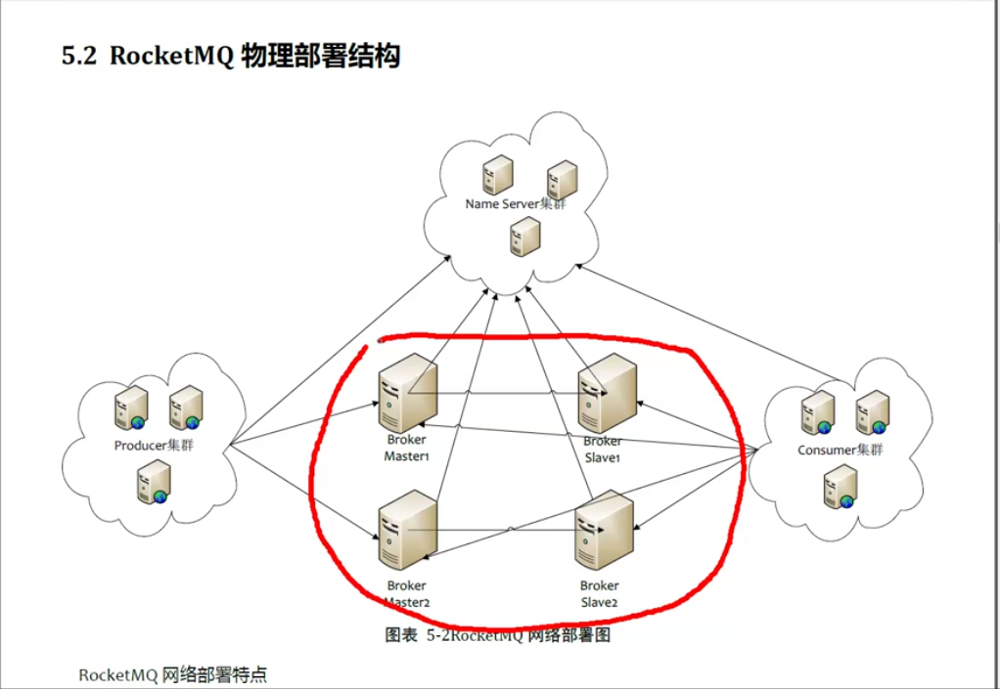

rocketmq物理部署结构.png # rok-ler!
## 简介
* 分布式、队列模型消息中间件
* 实现业务消峰，分布式事务
* 底层通信由Netty NIO实现
* 3.X版本以后使用NameServer进行网络路由，支持消息失败重试机制
* 零拷贝，顺序写盘，支持亿级消息堆积能力
* 顺序消息，事务消息
## 核心概念
* Push Consumer：Consumer的一种，注册一个Listener接口，一旦收到消息，Consumer对象立刻回调Listener接口方法。
* Pull Consumer：Consumer的一种，通常主动调用Consumer的拉消息方法从Broker拉消息，主动权由应用控制。
* Producer Group：一类Producer的集合名称，这类Producer通常发送一类消息，且发送逻辑一致。
* Consumer Group：一类Consumer的集合名称，这类Consumer通常消费一类消息，且消费逻辑一致。
* Broker：消息跳转角色，负责存储消息，转发消息，（即mq本身），一般也称为Server,在JMS规范中称为Provider。
* 广播消费：publish/subscribe，每个订阅的consumer都会消费
* 集群消费：一个group中的consumer平均分摊消费消息
## 集群构建模型
* 单master模式 风险较大，一旦宕机整个服务不可用
* 多master模式 一个集群无slave，全是Master

  > 优点：配置简单，宕机或重启维护对应用无影响

  > 缺点：宕机期间，这台机器上未被消费的消息在恢复前不可订阅
* 多master多slave模式，异步复制 每个master配置一个slave，有多对master-slave，异步复制方式，主备有短暂消息延迟，毫秒级

  > 优点：即使磁盘损坏，消息丢失的非常少，消息实时性不会受影响，master宕机后消费者仍然可以从slave消费，过程不需要人工干预，性能同多master模式几乎一样
  
  > 缺点：master宕机，磁盘损坏情况下会丢失少量消息
* 多master多slave模式，同步双写 每个master配置一个slave，有多对master-slave，采用同步双写方式，主备都写成功才向应用返回成功。

  > 优点：数据与服务都无单点，master宕机情况下，消息无延迟，服务可用性与数据可用性都非常高
  
  > 缺点：性能比异步复制模式略低，目前主宕机后，备机不能自动切换为主机，后续会支持
## RocketMQ物理部署结构

> NameServer是个几乎无状态节点，可集群部署，节点间无任何信息同步。

> Producer与Name Server集群中的其中一个节点（随机）建立长连接，定期从Name Server取Topic 路由信息，并向提供topic服务的Master建立长连接，且定时向master发送心跳。producer完全无状态，可集群部署。

> consumer与name server集群中的其中一个节点（随机）建立长连接，定期从Name server 取topic路由信息，并向提供的master,slave建立长连接，且定时向master,slave发送心跳。consumer既可以从master订阅消息，也可以从slave订阅消息，订阅规则由borker配置决定。
